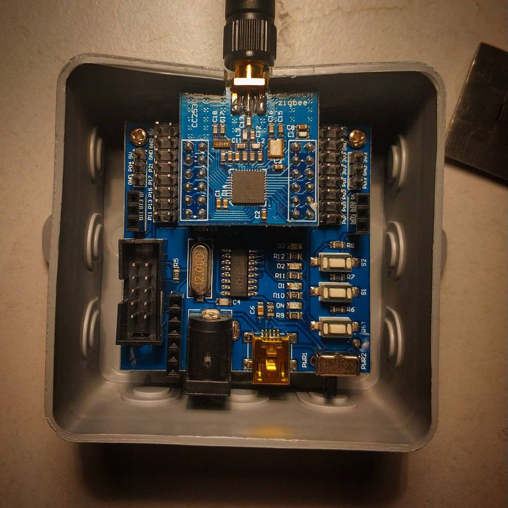

# Peter's Smart Home
My smart home configuration, based on [OpenHAB 2](https://www.openhab.org/)

# Features

* All lights in the house are smart-controllable
* All heating is smart-controllable
* Automatic scenarios and rules
* Smart-vacuum-cleaner is smart-controllable
* Climate control and information for all rooms

# Control panel

# Used devices

I have 2 general groups of devices. Main light in rooms mostly controlled by WiFi wall switches. Sensors, addional switches, decorative lamps and etc, are Zigbee.

## Zigbee

Network controlled by [DIY CC2530 zigbee2mqtt coordinator](https://www.zigbee2mqtt.io/information/supported_adapters.html).

### Sensors

* Xiaomi Aquara sensors (1st and 2nd gen)
* Aquara water leak sensor
* IKEA TRADFRI motion sensor (E1525/E1745)

### Devices

* IKEA TRADFRI ON/OFF switch (E1743)
* IKEA TRADFRI remote control (E1524/E1810)
* IKEA TRADFRI LED bulb E26/E27 806 lumen, dimmable, warm white (LED1836G9)
* IKEA TRADFRI LED bulb E27 806 lumen, dimmable, white spectrum, clear (LED1736G9)
* TRADFRI LED bulb E27 1000 lumen, dimmable, white spectrum, opal white (LED1732G11)
* IKEA TRADFRI LED bulb E27 WW clear 250 lumen,dimmable (LED1842G3)

# 3rd party software

## Dark sky weather animated icons

Used package from https://github.com/basmilius/weather-icons

