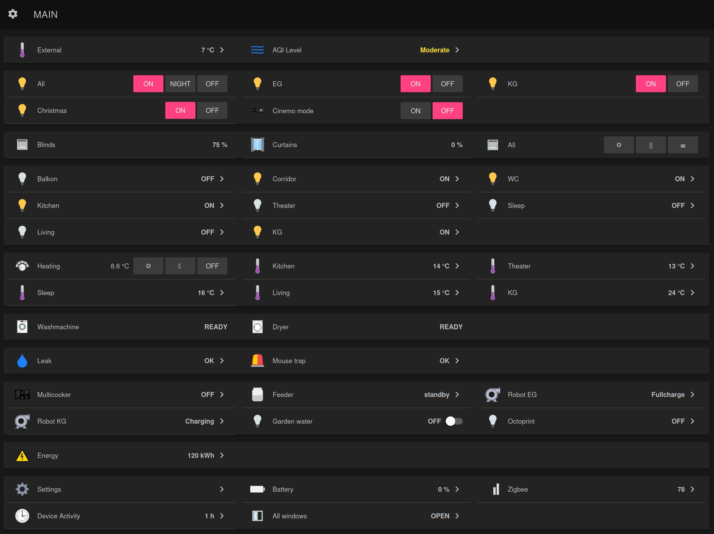
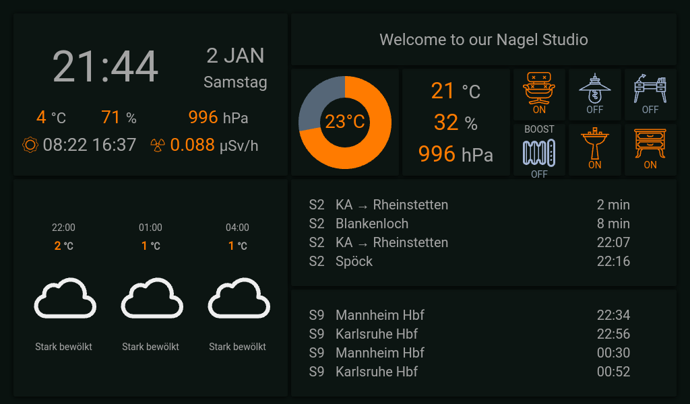

# Peter's Smart Home
My smart home configuration, based on [OpenHAB 3](https://www.openhab.org/)

# Features

* All lights in the house are smart-controllable
* All heating is smart-controllable
* Automatic scenarios and rules
* Smart-vacuum-cleaner is smart-controllable
* Climate control and information for all rooms

# Control panel




# Used devices

I have 2 general groups of devices. Main light in rooms mostly controlled by WiFi wall switches. Sensors, addional switches, decorative lamps and etc, are Zigbee.

## Zigbee

Network controlled by [Electrolama zig-a-zig-ah! (zzh!)](https://www.zigbee2mqtt.io/information/supported_adapters.html).


# 3rd party software

## Dark sky weather animated icons

Used package from https://github.com/basmilius/weather-icons

## Player icons

Part of FontAwesome project: https://fontawesome.com/license

# Openhab

Send command to device via CLI
```
docker exec -it  Openhab /openhab/runtime/bin/client
openhab:send g_zigbee_ota OFF
```

# Code model

Configuration model.

## Rooms and places

* ``EG`` - Ground floor
* ``KS`` - Cinema room (german "KinoSaal")
* ``BZ`` - Bathroom (german "BadZimmmer")
* ``KU`` - Kitchen (german "KUeche")
* ``WZ`` - Living room (german "WohnZimmer")
* ``SZ`` - Bedroom (german "SchlafZimmer")
* ``KG`` - Underground floor

## Naming

Items, groups: ``<location>[_<sub-location>]_<type>``:

* ``sz_bed_light``
* ``eg_light``
* ``wz_main_remote``
* ``wz_climate``
